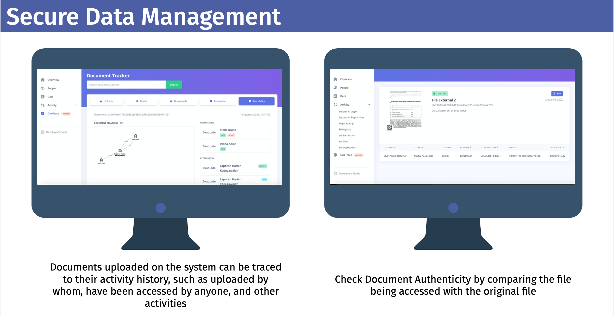
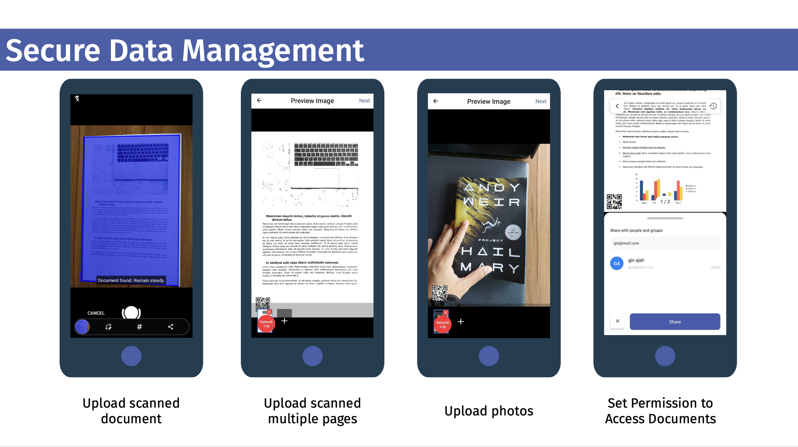

# Programming test

## Question 1
Your company is running a test that is designed to compare three different versions of the company’s
website.
Version X of the website is shown to 45% of users, version Y of the website is shown to 30%, while version
Z the remaining 25% of users. The test shows that 12% of users who are presented with version X sign up
for the company’s services, compared to 8% of users who are presented with version Y and 10% sign up
with version Z.
If a user signs up for the company’s services, what is the probability that she/he was presented with version
X of the website?

## Question 2
Write a program that prints the numbers from 1 to 100. But for multiples of 3 print “Fizz” instead of the
number and for the multiples of 5 print “Buzz”. For numbers which are multiples of both 3 and 5 print
“FizzBuzz”. Write with the most convenient programming language for you with proper explanation in your
code.

## Question 3
Vorta is currently developing a secure document management system, that provides a dashboard to monitor every uploaded documents from our mobile app. The mobile app and the dashboard can be seen as below:

From the case above, please do the following tasks:
1. Create the software architecture of the aplication, from the database, storage, backend, and frontend.
2. Create the business process (flow chart/etc.) of the system and database
design for this case (user can upload any documents from mobile app, and admin can check the document and its activity logs).
3. Create the endpoints to:
    1. Register
    2. Login
    3. Upload Documents -> You can use cloud storage such as cloudinary or S3.

The program should be run in users's device.

### Question 1, Question 2, and Question 3, should be pushed in a repository (Github/Gitlab) that can be accessed by the user.
